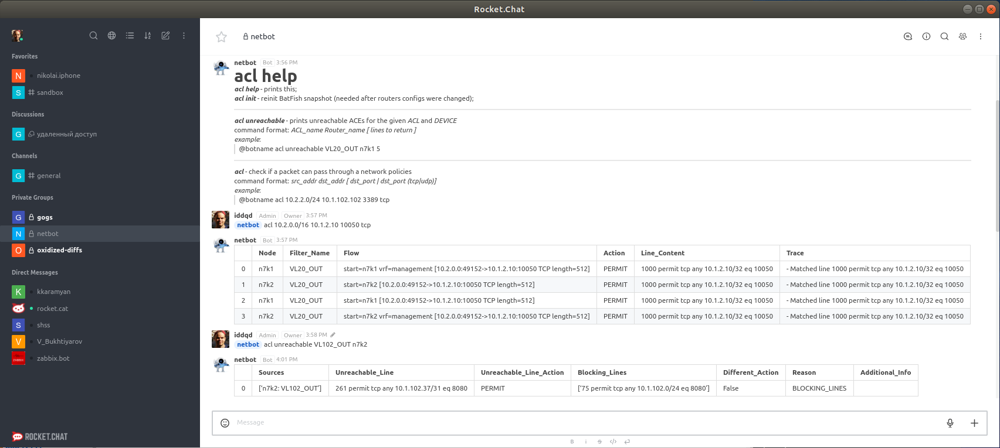
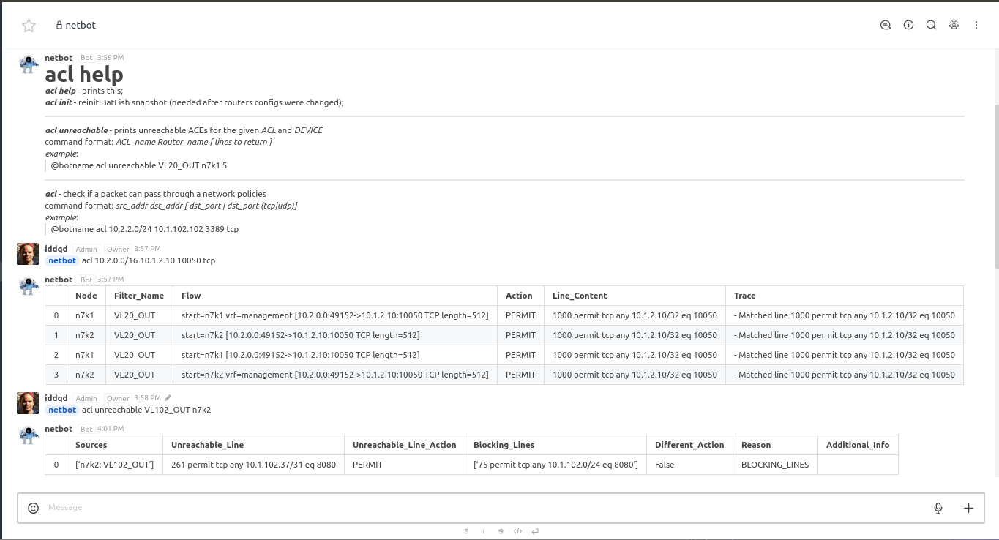
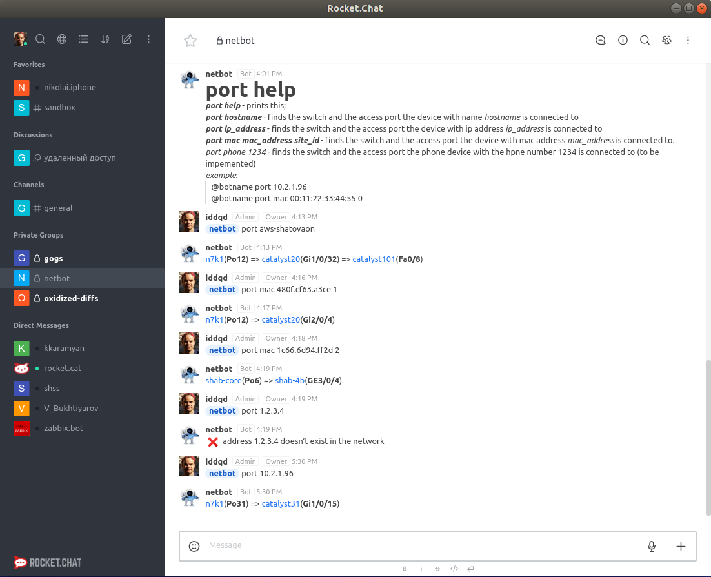
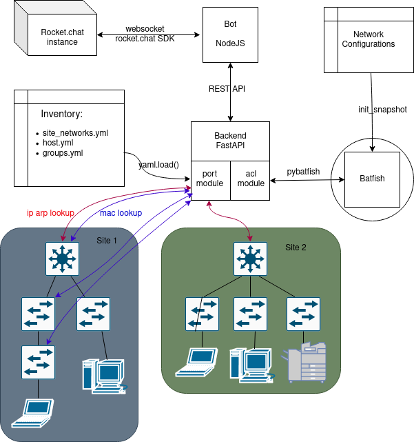
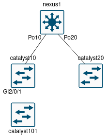
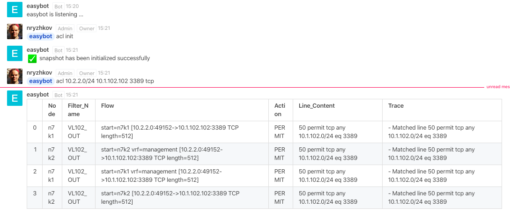

# NetOp Bot for rocket.chat

The bot is intended to help in a system network operations.  
The very first function that has been released is **acl**.  
**acl** checks if a given ip packet can pass throuth  the network with network policies being applied. 
Also it can check for inactive rules inside a given ACL.  

That is how it looks in an action:  


the same picture with more detailed view:  


**acl** uses the [**batfish**](https://www.batfish.org/) under the hood.

Later the second function was added. The **port** function.  
It finds a network switch and a port a hostname, ip or mac is connected to.

And this is how the port function looks in an action:


The **port** function currently supports the following platforms:  
  - ios/iosxe (core and access)
  - nxos (core and access)
  - junos (access only)
  - huawei (core and access)

----

## deployment

The application consists of two pices: the Bot and the Backend.

the Bot interacts with rocket.chat instance and sends requests to the Backend via GET/POST http requests.
the Backend do all the job: walking throuth the networks or interacts with the batfish.

Thus all the functions the Backend is capable of could be used not only from the Rocket.chat but from any other application.  

Application architecure:

  

### 1. Deploing Bot 

Bot is a nodejs application. It uses rocket.chat SDK and a node-fetch module. To run Bot first you have to install that modules under the Bot directory.

```
cd bot
npm install
```
next open up *netbot.js* file in any editor and change chatbots url, botname and credentials  
or you can init the corresponding environment variables. The more detailed description of ENV can be found below in the docker section.

now you can run bot just typing:
```
node netbot.js
```


### 2. Deploing Backend

Backend is a python application that uses the [FastAPI](https://fastapi.tiangolo.com/) framework.  
**FastAPI** is a pip package that will be set up along with over libraries by issuing the command:

```
cd backend
pip3 install -r requirements.txt
```

### 2.1 ACL
**acl** function uses the pybatfish library. 
Note: pybatfish comes with pandas (Data analysisi library) version 0.26.x, but the application uses the function .to_markdown() that appeared since version 1.0.0. So packages must be installed in order: first install pybatfish, next - pandas. So if you already have installed the needed libraries make sure **pandas** version >= 1.0.0 
```
pip3 show pandas
```
and if not upgrade it with the following command:
```
pip3 install --upgrade pandas
```

now run batfish in a docker container:
```
docker run --name batfish -v batfish-data:/data -p 8888:8888 -p 9997:9997 -p 9996:9996 batfish/allinone
```

It's time to make sure batfish is working.   
To do that you have to prepare network configuration files and place them under the directory
```
backend/bf_snapshots/networks/configs
```
then run interactive python (ipython or bpython) and excute the following code:
```
import pandas as pd
from pybatfish.client.commands import *
from pybatfish.datamodel import *
from pybatfish.datamodel.answer import *
from pybatfish.datamodel.flow import *
from pybatfish.question import *
from pybatfish.question import bfq
load_questions()
bf_session.host = 'localhost'
bf_set_network('bf1')
bf_init_snapshot('./bf_snapshots/networks', 'snapshot-01', overwrite=True)
```
batfish should find the configs and then a snapshot should be created. If all went well you can exit the interactive python shell and finally run the application by typing the command:
```
uvicorm main:app 
```
Actually you don't have to init snapshot manually every time the network configs has been changed.
There is the special command to do that from within the application. 
**@botname acl help** - command will help you to reveal it

### 2.2 PORT

The **port** function code uses [scrapli](https://github.com/carlmontanari/scrapli) librari under the hood along with common libraries such as *ipaddress* and *netaddr*. You have already set up all the libraries at the beginning of the chapter.

Now we need to prepare **inventory** that describes the networks we would like to use it on.  
There three inventory files that have to be created (edited):  
#### site_network.yml  

The **port** function supports multisites.  
Every site must have a core switch that holds an **ip arp table**.  
The file *inventory/site_network.yml* is used to determining the relationship between IP subnets (or site id) and the core switches

```yml
---
sites:
  - name: moscow
    networks:
      - 10.1.0.0/17
      - 10.2.0.0/16
    core: n7k1
    siteID: 1

  - name: samara
    networks:
      - 10.1.160.0/19
      - 10.1.220.0/24
    core: sam-core
    siteID: 2
```
The networks here are aggregated supernets that you use or intend to use in the future.
Based on the requested IP address or siteID, the application finds the name of the main switch it would start walking from

#### hosts.yml  

The **port** function is a recursive walker that first finds out the mac address from the arp table on a core switch and then walks from the top (core) to bottom of a network tree looking for an endport with that mac. this tree has to be described in the file: *inventory/hosts.yml*

Lets pretend we have the following network topology  


The *hosts.yml* for that topology would look like that

```yml
---
n7k1:
  hostname: nexus1
  groups:
    - moscow
    - core
    - nexus
  data:
    role: core    
    children: 
      Po10: catalyst10
      Po20: catalyst20
      
catalyst10:
  hostname: catalyst10  
  groups:
    - moscow
    - ios        
  data:
    role: access    
    children: 
      Gi2/0/1: catalyst101     
      
catalyst20:
  hostname: catalyst20  
  groups:    
    - ios        
  data:
    transport: telnet    

catalyst101:
  hostname: catalyst101  
  groups:    
    - ios      
```
The logic here is pretty straightforward. First the application is looking for a port the mac is located behind. If that port exists in the children section of a current switch it takes the next switch name (from the *port:switch* keypair) and starts walking over it. If there is no children then the function returns the last port name.  
*Note1:* only hostname and group that defines a platform (ios,nxos,junos,...) is mandatory fields.  
*Note2:* it is possible to use **transport:telnet** option for old cisco switches that do not supports ssh (look at catalyst20 options)

#### groups.yml

*groups.yml* keeps the group info such as credentials or ssh_keys and a platform.  
The platform name specify's the driver the underlying framework ([scrapli](https://github.com/carlmontanari/scrapli)) would use to connect to a device.

```yml
---
groups:
  nexus:
    platform: nxos
    username: cisco
    password: cisco
  ios:
    platform: ios
    username: backup
    password: backup
  huawei:
    platform: huawei
    username: admin
    password: admin
  junos:
    platform: junos
    username: rancid
    auth_private_key: ~/rocket/rancid_rsa    
```
If you know [Nornir](https://nornir.readthedocs.io) both the *hosts.yml* and *groups.yml* would looks familiar. This is because I planed to use **Nornir** at the beginning. And the logic here is the same. Except I do not use complex objects. Only plain python's dictionary. First I fill up **hosts** dictionary from the *hosts.yml* and then enrich every host in the **hosts** with the group information.   

Thats all for now. In the previous section (deploying **acl** function) we have already started the Backend application. So it has to be working already along with the Bot process.

Make sure the processes are running and then try to communicate with the Bot by typing different commands. Its reasonable to start from commands **acl help** or **port help**


## Docker (optional)

Now I'll try to dockerise the service to be more convinient to use

There will be three docker containers:  
  1. batfish
  2. backend
  3. bot

All three containers shouldn't expose their network ports because they are sharing the same inner network.

### 1. batfish container
Batfish is being delivered as a docker container from the very beginig.  
But the running string has to be modified a little.  
First lets add a ***-d*** parameter so the container will be starting in a detached state.  
And second as all three containers share the inner network it's not needed to expose any network ports.
```
docker run -d --name batfish -v batfish-data:/data batfish/allinone
```
### 2. backend container

For the backend there is a docker file ***backend.dockerfile*** in the root folder. It was made based on a [FastAPI tutorial: Deployment#Docker](https://fastapi.tiangolo.com/deployment/#docker)

To build a container run the following command: 
```
sudo docker build -t netbot.backend -f ./backend.dockerfile .
```
After the docker has been built successfully we can run the container:
```
sudo docker run -d --name backend -v ~/configs:/app/bf_snapshots/networks/bf1/configs --link batfish -e BF_HOSTNAME=batfish netbot.backend
```
Take a look closely at these options -v, -e and --link

For a dockerized version the network configs folder has been brought out ouside of the container. Thus we have separated data (configs) from the code (container) and we can put new configs at any time after the container has been built and ran.
To map the configs folder with the container the option ***-v*** (or --volume) is being used

***-e*** and ***--link*** options point out to the **batfish** container.  
both parameters must contain tbe same value

### 3. bot container

The docker file named ***bot.dockerfile*** is in the root folder as usual.  
To build a container run the following command:
```
docker build -t netbot.bot -f bot.dockerfile .
```
It's not very usefull to edit code and rebuilt a docker image every time you want to cange some connection variables. That is why the mandatory environment variables comes to a dockerized version. There are a number of ENV variables 

 * *ROCKET_HOST* - the url the rocket.chat is running on
 * *ROCKET_USER* - rocket.chat bot user 
 * *ROCKET_PASS* - rocket.chat bot password
 * *ROCKET_BOTNAME* - rocket.chat bot name by wich it is called to
 * *BACKEND_API_URL* - the url the backend api is accessible e.g. *http://backend/api/*

The resulting *run* command would be something like that:
```
docker run --name bot -d --link backend -e BACKEND_API_URL=http://backend/api/ -e ROCKET_HOST=https://rocket.acme -e ROCKET_USER=bot -e ROCKET_PASS=botpass -e ROCKET_BOTNAME=netbot netbot.bot
```
---- 
Now all three containers should be up and running.
```bash
a@oldbox:~/work$ docker ps
CONTAINER ID        IMAGE               COMMAND             CREATED              STATUS              PORTS                     NAMES
762ffc991947        netbot.bot          "node netbot.js"    12 seconds ago       Up 10 seconds                                 bot
c723b35bd225        netbot.backend      "/start.sh"         About a minute ago   Up 59 seconds       80/tcp                    backend
340717cde310        batfish/allinone    "./wrapper.sh"      2 minutes ago        Up 2 minutes        8888/tcp, 9996-9997/tcp   batfish

```

And the message ( *netbot is listenig...* ) should appear in the given rocket.chat channel.  
But there is one final step left - we have to initialize the batfish snapshot. It can be done by issuing the following command in a rocket.chat client:
```
@netbot acl init
```
The operation takes a couple of seconds (depends of underlying hardware perfomance) and if all goes well it should return a message of success. Now the service can be fully used.



