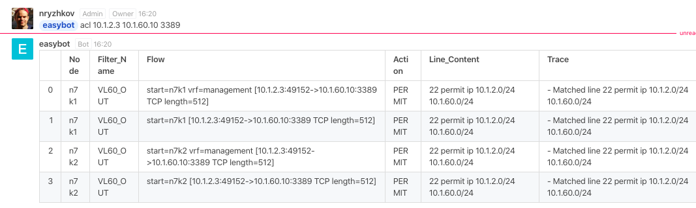

# NetOp Bot for rocket.chat

the bot is intended to help in a system network operations.  
the very first function that has been released is **acl**.  
**acl** checks if a given ip packet can pass throuth  the network with network policies being applied. 

That is how it looks in an action:  


the more detailed view:  


**acl** uses the **batfish** under the hood.

----

## deployment

The application consists of two pices: the Bot and the backend.

the Bot interacts with rocket.chat instance while the backend interacts with the batfish.

And finally the Bot sends requests to backend via GET/POST http requests.


### 1. Deploing Bot 

Bot is a nodejs application. It uses rocket.chat SDK and a node-fetch module. To run Bot first you have to install that modules under the Bot directory.

```
cd bot
npm install
```
next open up *netbot.js* file in any editor and change chatbots url, botname and credentials  
or you can init the corresponding environment vaariables. The more detailed description of ENV can be found below in the docker section.

now you can run bot just typing:
```
node netbot.js
```


### 2. Deploing Backend

Backend is a python application that uses the FastAPI framework and the pybatfish library. 
Note: pybatfish comes with pandas (Data analysisi library) version 0.26.x, but the application uses the function .to_markdown() that appeared since version 1.0.0. So packages must be installed in order: first install pybatfish, next - pandas.

```
pip3 install pybatfish
pip3 install --upgrade pandas
```
and install fastAPI as well:
```
pip3 install fastapi
pip3 install uvicorn
```
now run batfish in a docker container:
```
docker run --name batfish -v batfish-data:/data -p 8888:8888 -p 9997:9997 -p 9996:9996 batfish/allinone
```

It's time to make sure batfish is working.   
To do that you have to prepare network configuration files and place them under the directory
> backend/bf_snapshots/networks/configs

then run interactive python (ipython or bpython) and excute the following code:
```
import pandas as pd
from pybatfish.client.commands import *
from pybatfish.datamodel import *
from pybatfish.datamodel.answer import *
from pybatfish.datamodel.flow import *
from pybatfish.question import *
from pybatfish.question import bfq
load_questions()
bf_session.host = 'localhost'
bf_set_network('bf1')
bf_init_snapshot('./bf_snapshots/networks', 'snapshot-01', overwrite=True)
```
batfish should find the configs and then a snapshot should be created. If all went well you can exit the interactive python shell and finally run the application by typing the command:
```
uvicorm main:app 
```
Actually you don't have to init snapshot manually every time the network configs has been changed.
There is the special command to do that from within the application. 
**@botname acl help** - command will help you to reveal it


## Docker

Now I'll try to dockerise the service to be more convinient to use

There will be three docker containers:  
  1. batfish
  2. backend
  3. bot

All three containers shouldn't expose their network ports because they are sharing the same inner network.

### 1. batfish container
Batfish is being delivered as a docker container from the very beginig.  
But the running string has to be modified a little.  
First lets add a ***-d*** parameter so the container will be starting in a detached state.  
And second as all three containers share the inner network it's not needed to expose any network ports.
```
docker run -d --name batfish -v batfish-data:/data batfish/allinone
```
### 2. backend container

For the backend there is a docker file ***backend.dockerfile*** in the root folder. It was made based on a [FastAPI tutorial: Deployment#Docker](https://fastapi.tiangolo.com/deployment/#docker)

To build a container run the following command: 
```
sudo docker build -t netbot.backend -f ./backend.docker .
```
After the docker has been built successfully we can run the container:
```
sudo docker run -d --name backend -v ~/configs:/app/bf_snapshots/networks/bf1/configs --link batfish -e BF_HOSTNAME=batfish netbot.backend
```
Take a look closely at these options -v, -e and --link

For a dockerized version the network configs folder has been brought out ouside of the container. Thus we have separated data (configs) from the code (container) and we can put new configs at any time after the container has been built and ran.
To map the configs folder with the container the option ***-v*** (or --volume) is being used

***-e*** and ***--link*** options point out to the **batfish** container.  
both parameters must contain tbe same value

### 3. bot container

The docker file named ***bot.dockerfile*** is in the root folder as usual.  
To build a container run the following command:
```
docker build -t netbot.bot -f bot.dockerfile .
```
It's not very usefull to edit code and rebuilt a docker image every time you want to cange some connection variables. That is why the mandatory environment variables comes to a dockerized version. There are a number of ENV variables 

 * *ROCKET_HOST* - the url the rocket.chat is running on
 * *ROCKET_USER* - rocket.chat bot user 
 * *ROCKET_PASS* - rocket.chat bot password
 * *ROCKET_BOTNAME* - rocket.chat bot name by wich it is called to
 * *BACKEND_API_URL* - the url the backend api is accessible e.g. *http://backend/api/*

The resulting *run* command would be something like that:
```
docker run --name bot -d --link backend -e BACKEND_API_URL=http://backend/api/ -e ROCKET_HOST=https://rocket.acme -e ROCKET_USER=bot -e ROCKET_PASS=botpass -e ROCKET_BOTNAME=easybot netbot.bot
```
---- 
Now all three containers should be up and running.
```bash
a@oldbox:~/work$ docker ps
CONTAINER ID        IMAGE               COMMAND             CREATED              STATUS              PORTS                     NAMES
762ffc991947        netbot.bot          "node netbot.js"    12 seconds ago       Up 10 seconds                                 bot
c723b35bd225        netbot.backend      "/start.sh"         About a minute ago   Up 59 seconds       80/tcp                    backend
340717cde310        batfish/allinone    "./wrapper.sh"      2 minutes ago        Up 2 minutes        8888/tcp, 9996-9997/tcp   batfish

```

And the message ( *easybot is listenig...* ) should appear in the given rocket.chat channel.  
But there is one final step left - we have to initialize the batfish snapshot. It can be done by issuing the following command in a rocket.chat client:
```
@easybot acl init
```
The operation takes a couple of seconds (depends of underlying hardware perfomance) and if all goes well it should return a message of success. Now the service can be fully used.


